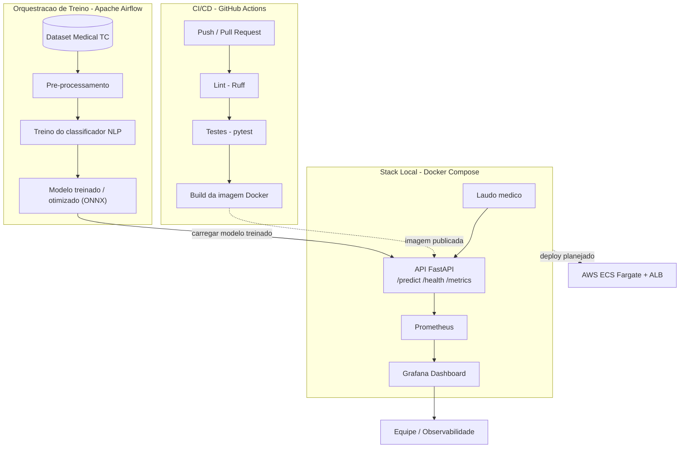

# Sistema de Triagem Automática de Laudos Médicos
## MLET Tech Challenge - Fase 3: MLOps e Ciclo de Vida do Modelo

Este repositório contém a solução completa para o sistema de triagem automática de laudos médicos de um hospital de referência, com foco na classificação automatizada de níveis de urgência (**Normal**, **Atenção** e **Urgente**). 

O projeto adota práticas rigorosas de MLOps, abrangendo desde a concepção arquitetural e a otimização de latência do modelo de Processamento de Linguagem Natural (NLP) até a orquestração de pipelines de retreino, CI/CD e monitoramento em tempo real.

---

## Visão Geral da Arquitetura



**Legenda:** setas sólidas representam fluxo implementado e em uso hoje;
setas tracejadas representam integrações planejadas na especificação do
desafio mas ainda pendentes (publicação da imagem no registry e o deploy
em nuvem, documentado na seção 2). A API já carrega o modelo em `/predict`
e a DAG de retreino está em `dags/clinical_triage_retrain.py`.

---

## 1. Contexto Clínico e de Negócio

No cenário de um hospital de referência, a velocidade e a precisão no atendimento de pronto-socorro salvam vidas. A triagem de laudos médicos por métodos puramente manuais gera gargalos operacionais e atrasos na identificação de casos de altíssimo risco (como AVCs, infartos agudos do miocárdio ou hemorragias graves). 

Este sistema automatiza a análise textual dos laudos médicos utilizando NLP, fornecendo uma classificação de urgência em milissegundos para que a equipe de saúde possa priorizar imediatamente o atendimento dos pacientes em estado crítico.

---

## 2. Decisão de Arquitetura em Nuvem: Batch vs. Real-Time vs. Serverless

A escolha da arquitetura de deploy do modelo de Machine Learning determina a viabilidade clínica do projeto. Abaixo, detalha-se a deliberação técnica para a definição da infraestrutura ideal na nuvem (utilizando como referência a **AWS**):

### 2.1. Processamento em Lote (Batch Deploy) — **Descartado**
*   **Conceito:** Acumular laudos médicos e processá-los periodicamente (ex.: a cada 30 minutos ou uma vez por hora).
*   **Por que não atende:** Um paciente que dá entrada no pronto-socorro com sintomas graves não pode aguardar a execução do próximo lote de dados para ter seu caso classificado como urgente. A latência do processamento em lote é incompatível com a tomada de decisão em tempo real na saúde, representando um risco crítico para os pacientes.

### 2.2. Tempo Real com Serverless puro (Scale-to-Zero) — **Descartado**
*   **Conceito:** Executar o container em soluções Serverless (como AWS Lambda ou Google Cloud Run clássico) onde os recursos são alocados sob demanda e escalonados até zero na ausência de requisições.
*   **Por que não atende:** 
    1.  **Cold Start (Inicialização Fria):** Se a API passar alguns minutos inativa, a infraestrutura destrói os containers. Quando uma nova requisição crítica chega, há uma latência de inicialização do ambiente (*cold start*) de 5 a 15 segundos. Na medicina de emergência, essa demora adicional é inaceitável.
    2.  **Incompatibilidade com o Monitoramento (Prometheus):** O Prometheus utiliza o modelo de *pull* (raspagem ativa) de métricas por meio de endpoints HTTP persistentes (`/metrics`). Em uma arquitetura Serverless purista que escala para zero ou cria containers dinâmicos com IPs efêmeros, o Prometheus local e as ferramentas de observabilidade perdem o alvo de coleta, inviabilizando o monitoramento contínuo exigido pelo projeto.

### 2.3. Tempo Real com Instâncias Dedicadas/Gerenciadas (Always-On) — **A Escolha Ideal**
*   **Conceito:** A API FastAPI é servida em containers Docker mantidos continuamente ativos e gerenciados por um orquestrador com escalonamento elástico.
*   **Tecnologia de Nuvem Recomendada:** **AWS ECS Fargate** configurado com um número mínimo de tarefas ativas (`Desired Tasks >= 1`) atrás de um Application Load Balancer (ALB).
*   **Justificativa Técnica:**
    *   **Zero Latência de Cold Start:** Como pelo menos um container está sempre ligado, a inferência é imediata para qualquer laudo recebido, garantindo latência previsível e ultra-baixa.
    *   **Compatibilidade Total de Observabilidade:** O container mantido ativo e exposto sob uma rede controlada permite que o Prometheus realize a raspagem periódica de métricas com total confiabilidade.
    *   **Escalabilidade Elástica:** Caso ocorra um pico repentino de atendimento no pronto-socorro, o ECS Fargate realiza o *Autoscaling* com base no uso de CPU/RAM ou volume de requisições por segundo (RPS), provisionando mais containers sem interromper o serviço.

---

## 3. Estrutura do Projeto

O repositório está organizado de forma modular para refletir as etapas do ciclo de vida de desenvolvimento e MLOps:

```text
clinical-triage-mlops/
├── .github/
│   └── workflows/
│       └── ci.yml                    # Pipeline de CI/CD (lint → test → build)
├── data/
│   ├── raw/                          # Dados brutos do dataset Medical TC
│   │   ├── medical_tc_train.csv
│   │   ├── medical_tc_test.csv
│   │   └── medical_tc_labels.csv
│   └── processed/                    # Dados pré-processados com coluna de urgência
│       ├── medical_tc_train_processed.csv
│       └── medical_tc_test_processed.csv
├── docs/
│   ├── evidencias/
│   │   └── grafana-dashboard.png     # Print do dashboard em execução, com dados reais
│   └── monitoring.md                 # Documentação das métricas e painéis do Grafana
├── grafana/
│   └── provisioning/
│       ├── dashboards/                # Dashboard do Grafana provisionado automaticamente
│       └── datasources/               # Datasource do Prometheus provisionado automaticamente
├── prometheus/
│   └── prometheus.yml                # Configuração de scrape do Prometheus
├── scripts/
│   └── generate_traffic.py           # Gera tráfego sintético para validar o dashboard
├── dags/
│   └── clinical_triage_retrain.py     # DAG Airflow (preprocess → treino → ONNX)
├── src/
│   ├── api/                          # Código-fonte da API FastAPI
│   │   ├── __init__.py
│   │   ├── main.py                   # Rotas /health, /predict e /metrics
│   │   ├── predictor.py              # Carga do modelo e inferência
│   │   └── schemas.py                # Schemas Pydantic (request/response)
│   ├── data/                         # Módulo de pré-processamento de dados
│   │   ├── __init__.py
│   │   └── preprocess.py             # Mapeamento de especialidades → urgência
│   ├── model/                        # Treino do classificador NLP
│   │   ├── __init__.py
│   │   ├── train.py                  # Pipeline TF-IDF + Random Forest
│   │   ├── export_onnx.py            # Exportação do classificador para ONNX
│   │   └── benchmark.py              # Comparativo de latência sklearn vs ONNX
│   └── orchestration/                # Etapas reutilizadas pela DAG
│       ├── __init__.py
│       └── pipeline.py               # preprocess → train → export
├── models/
│   ├── metrics.json                  # Métricas do último treino
│   └── latency_benchmark.json        # Resultado do benchmark de latência
├── tests/
│   ├── conftest.py                   # Modelo leve para testes da API
│   ├── test_api.py                   # Testes dos endpoints /health e /predict
│   ├── test_export_onnx.py           # Testes da exportação ONNX
│   ├── test_metrics.py               # Testes da instrumentação Prometheus
│   ├── test_orchestration.py         # Testes do pipeline / DAG
│   ├── test_preprocess.py            # Testes do pré-processamento de dados
│   └── test_train.py                 # Testes do pipeline de treino
├── .pre-commit-config.yaml           # Hooks de pre-commit (Ruff lint + format)
├── docker-compose.yml                # Orquestração local da API, Prometheus e Grafana
├── Dockerfile                        # Instruções de empacotamento da API
├── eda.ipynb                         # Notebook de Análise Exploratória de Dados
├── pyproject.toml                    # Dependências e configurações (gerenciado via uv)
└── README.md                         # Documentação principal
```

---

## 4. Desempenho e Comparativo de Latência

A tabela abaixo compara o pipeline sklearn (baseline) com a inferência
otimizada via ONNX Runtime. O TF-IDF permanece em joblib e o Random Forest
é exportado para ONNX — a acurácia/F1 se mantém e a latência cai de forma
expressiva. Números gerados com `python -m src.model.benchmark`
(amostra de 50 laudos do conjunto de teste).

| Modelo / Abordagem | Acurácia (F1 macro) | Latência Média (ms) | Taxa de Vazão (Req/s) | Status |
| :--- | :---: | :---: | :---: | :---: |
| **Modelo Base (TF-IDF + Random Forest)** | 0.52 | 72.87 | 13.72 | Baseline |
| **Modelo Otimizado (ONNX Runtime)** | 0.52 | 2.44 | 410.66 | Otimizado |

O detalhamento completo está em `models/latency_benchmark.json`.

---

## 5. Instruções de Execução (Ambiente Local)

### 5.1. Pré-requisitos
*   **Docker** e **Docker Compose** instalados na máquina.
*   **uv** instalado (gerenciador de pacotes e ambientes virtuais ultrarrápido do Python).

### 5.2. Configurando o Ambiente de Desenvolvimento
Para inicializar o ambiente virtual e instalar todas as dependências locais utilizando o `uv`:

```bash
# Inicializar o projeto (caso necessário criar o pyproject.toml)
uv init

# Criar o ambiente virtual isolado (.venv)
uv venv

# Instalar as dependências registradas no projeto
uv sync
```

### 5.3. Executando a API Localmente (Modo Desenvolvimento)
Antes de subir a API, gere o artefato do modelo (caso ainda não exista em `models/`):

```bash
uv run python -m src.model.train
```

Para exportar o classificador para ONNX (se o treino não tiver gerado o artefato)
e medir a latência:

```bash
uv sync --extra optimize
uv run python -m src.model.export_onnx
uv run python -m src.model.benchmark
```

Com o ambiente ativado, você pode iniciar o servidor FastAPI local para desenvolvimento:

```bash
# Ativar o ambiente virtual (.venv)
source .venv/bin/activate  # No Linux/macOS
# .venv\Scripts\activate  # No Windows

# Executar a API com hot-reload
uvicorn src.api.main:app --reload --host 0.0.0.0 --port 8000
```
*   Acesse a documentação interativa da API em: `http://localhost:8000/docs`

### 5.4. Executando a Stack Completa via Docker Compose
Para simular o ambiente de produção local com a API FastAPI, o Prometheus e o Grafana operando integrados:

```bash
# Construir e iniciar os serviços em segundo plano
docker-compose up --build -d
```

#### Portas dos Serviços Locais:
*   **FastAPI API REST:** `http://localhost:8000`
*   **Prometheus Console:** `http://localhost:9090`
*   **Grafana Dashboard:** `http://localhost:3000` (Credenciais padrão: admin / admin)

Para o detalhamento das métricas expostas, dos painéis do dashboard e do
passo a passo de validação local, consulte [`docs/monitoring.md`](docs/monitoring.md).

#### Instância em Produção (VPS)

A stack também está no ar na VPS do grupo para avaliação:

*   **API:** `http://82.29.57.75:8000` (docs em `/docs`)
*   **Prometheus:** `http://82.29.57.75:9090`
*   **Grafana:** `http://82.29.57.75:3000` — usuário `admin`, senha `mlfiap2026`

A senha do Grafana nessa instância foi trocada manualmente via UI e fica
salva no volume `grafana_data`; um novo deploy a partir de um volume vazio
faz a senha voltar ao padrão `admin/admin`. Acesso temporário, mantido só
para a avaliação — o serviço será derrubado em seguida.

### 5.5. Orquestração de Retreino (Apache Airflow)

A DAG `clinical_triage_retrain` em `dags/` executa semanalmente:

1. preprocessamento dos CSVs brutos
2. treino do classificador TF-IDF + Random Forest
3. exportação do modelo para ONNX

As mesmas etapas podem rodar sem o Airflow (útil para debug local):

```bash
uv sync --extra optimize
uv run python -m src.orchestration.pipeline
```

Para registrar a DAG no Airflow (ambiente isolado do extra `orchestration`):

```bash
uv sync --extra orchestration --extra optimize
export AIRFLOW_HOME="$(pwd)/.airflow"
export AIRFLOW__CORE__DAGS_FOLDER="$(pwd)/dags"
export AIRFLOW__CORE__LOAD_EXAMPLES=False
export PYTHONPATH="$(pwd)"

uv run airflow db migrate
uv run airflow dags list
uv run airflow dags test clinical_triage_retrain 2024-01-01
```

A UI padrão fica em `http://localhost:8080` após `uv run airflow standalone`
(usuário/senha gerados no primeiro start). O Airflow não entra na imagem
Docker da API de propósito — a orquestração de treino fica desacoplada do
serviço de inferência.

---
